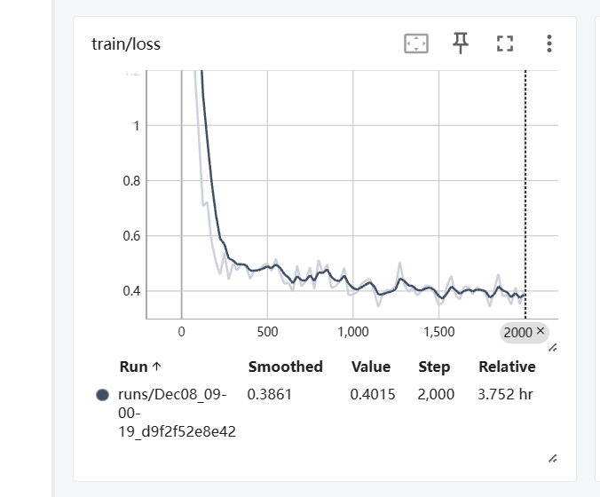
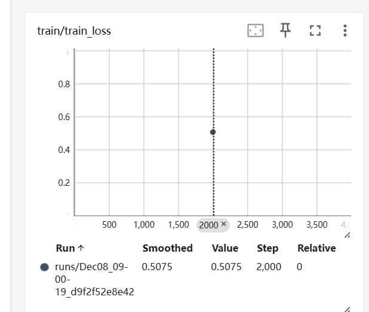
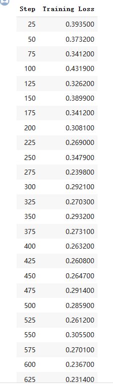

# ID2223_LAB2

## Authors
Jingyuan Han & Kaidi Xu

## Task2

### 1.  Improve model performance via hyperparameters tuning
The original training steps is 2000 steps, while the training loss curve is:

In order to see if there is still improvement space after 2000 steps, we increased the training steps to 3000 and trained a new model. Moreover, in order to avoid overfitting, we added a weight decay of 0.01, which added weight regularization to the training process. Unfortunately, since the new traning process was too long and we did this in the last days, we did not manage to finish the whole training and thus do the evaluation. In the end, we could compare the training loss of the original model (2000 steps) and the new (2700 steps with weight decay 0.01):

 

From the perpective of the training losses, which is 0.5075 (old model) to 0.2314 (new model), we might expect the performance of the new model to be better than the old one. However, we did not manage to do the evaluation to justify it.

### 2. Refactor the program
To add value to the readability and maintainability of the code, we refactored the program to a featrue engineering pipline (feature_pipline.py), a tranining pipline (training_pipline.py), an inference pipline (hugging face app.py), and a main program (fine_tune_whisper.ipynb).

The pipline files do the feature extraction, training, and inference work respectively, while the main program would become much compacter and easier to read. Moreover, if any part of the program does not work right, one could look into particular pipline files and modify on them.